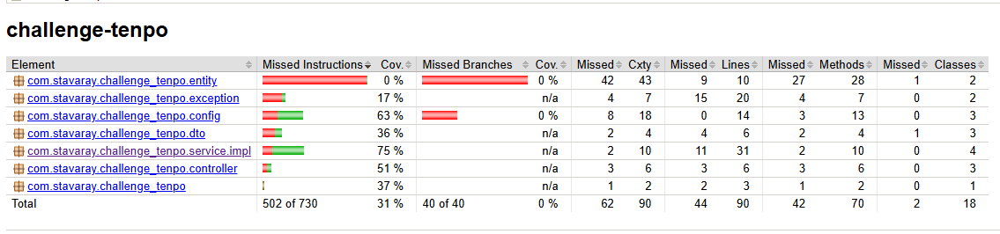
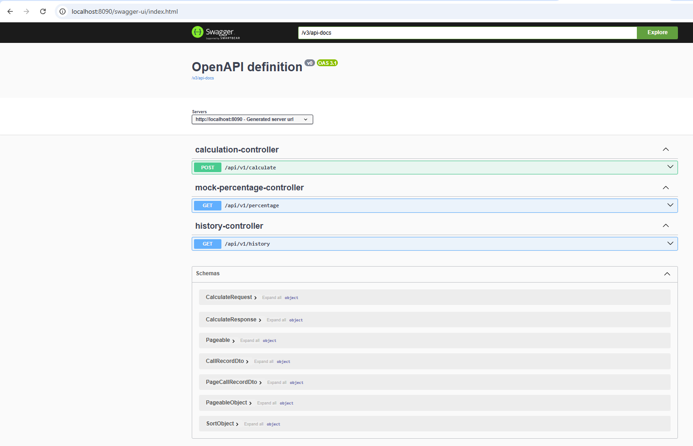

# Challenge Tenpo

## 📋 Prerrequisitos

- Java 21
- Maven 3+
- Docker (Docker Engine & Docker Compose)
- Git
---
## 🚀 Levantar en local

### 1. Clona el repositorio
   ```bash
   git clone https://github.com/D3vSty/challenge-tenpo.git
   cd challenge-tenpo
   ```
### 2. Construye el artefacto y corre los tests
```bash
mvn clean install
```
### 3. Arranca la aplicación
```bash
mvn spring-boot:run
```
### 4. Accede a http://localhost:8090

### 5. Coverage Test - Jacoco


### 6. Documentación API

---

## 🐳 Levantar con Docker Compose

### Nota: Para levantar toda la pila (base de datos, redes, etc.) en un solo comando.
1. Desde la raíz del proyecto, ejecuta:

    ```bash
    docker-compose up --build -d
    ```
2. Espera a que termine el build y los contenedores estén “Up”

3. La aplicación quedará disponible en http://localhost:8090

4. Para ver logs en tiempo real:

    ```bash
    docker-compose logs -f
    ```
- Para parar y eliminar contenedores/redes:

    ```bash
    docker-compose down
    ```
# 📡 Ejemplos de `curl` para probar las APIs

La aplicación corre en `http://localhost:8090` y la base de los endpoints es `/api/v1`:

---

## 1. Obtener documentación OpenAPI (Swagger)

```bash
curl --location 'http://localhost:8090/v3/api-docs'
```
## 2. Listar historial paginado

```bash
curl --location --request GET 'http://localhost:8090/api/v1/history?page=0&size=10' \
--header 'Content-Type: application/x-www-form-urlencoded' \
--data-urlencode 'page=0' \
--data-urlencode 'size=10'
```

## 3. Ejecutar cálculo (POST)
 ```bash
 curl --location --request POST 'http://localhost:8090/api/v1/calculate' \
     --header 'Content-Type: application/json' \
     --data '{
       "num1": 200,
       "num2":  50
     }'
```


